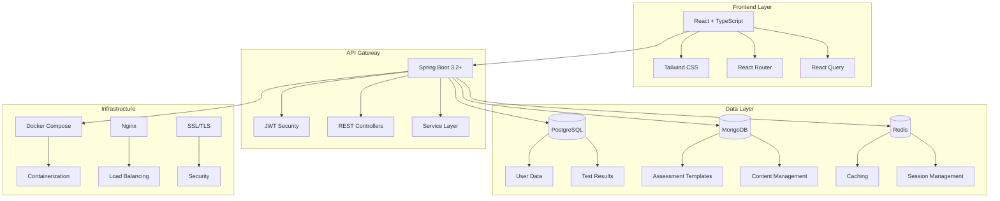

# Z Plus Counselling Platform 🧠💼

[](https://opensource.org/licenses/MIT)
[](https://spring.io/projects/spring-boot)
[](https://reactjs.org/)
[](https://www.typescriptlang.org/)
[](https://www.docker.com/)

> **A comprehensive web-based counselling and psychological assessment platform designed to provide professional mental health services, career guidance, and psychological testing.**

## 🎯 Platform Overview

Z Plus Counselling Platform is a full-stack web application that bridges the gap between individuals seeking mental health support and professional counselling services. Our platform offers:

- **30+ Psychological Assessments** (MBTI, Big Five, IQ Tests, Career Assessments)
- **Professional Counselling Services** with certified experts
- **Career Guidance & Recommendations** based on assessment results
- **Comprehensive User Management** with secure authentication
- **Real-time Analytics & Progress Tracking**
- **Mobile-Responsive Design** for accessibility across devices

## 🏗️ Architecture Overview



## 🚀 Quick Start

### Prerequisites
- **Java 17+** (for backend development)
- **Node.js 18+** (for frontend development)
- **Docker & Docker Compose** (for containerized deployment)
- **Git** (for version control)

### 🔧 Local Development Setup

1. **Clone the Repository**
   ```bash
   git clone https://github.com/Aryaanmalikk17/zpluscouncelling-project.git
   cd zpluscouncelling-project
   ```

2. **Start Backend Services**
   ```bash
   cd backend
   docker-compose up -d postgres mongodb redis
   ./mvnw spring-boot:run
   ```

3. **Start Frontend Development Server**
   ```bash
   cd my-frontend-app
   npm install
   npm run dev
   ```

4. **Access Applications**
   - **Frontend**: http://localhost:5173
   - **Backend API**: http://localhost:8080/api/v1
   - **API Documentation**: http://localhost:8080/swagger-ui.html

### 🐳 Docker Deployment

```bash
# Development Environment
cd backend
docker-compose up -d

# Production Environment
docker-compose -f docker-compose.prod.yml up -d
```

## 📁 Project Structure

```
zpluscouncelling-project/
├── 📄 README.md                    # Main documentation
├── 📄 LICENSE                      # MIT License
├── 📄 netlify.toml                 # Netlify deployment config
├── 📁 backend/                     # Spring Boot Backend
│   ├── 📄 pom.xml                  # Maven dependencies
│   ├── 📄 Dockerfile               # Backend container config
│   ├── 📄 docker-compose.yml       # Development services
│   ├── 📄 docker-compose.prod.yml  # Production services
│   ├── 📁 src/main/java/           # Java source code
│   │   └── com/zplus/counselling/  # Main package
│   │       ├── 📁 controller/      # REST Controllers
│   │       ├── 📁 service/         # Business Logic
│   │       ├── 📁 entity/          # Database Entities
│   │       ├── 📁 repository/      # Data Access Layer
│   │       ├── 📁 dto/             # Data Transfer Objects
│   │       ├── 📁 config/          # Configuration Classes
│   │       └── 📁 security/        # Security Components
│   ├── 📁 src/main/resources/      # Configuration files
│   └── 📁 scripts/                 # Database initialization
├── 📁 my-frontend-app/             # React Frontend
│   ├── 📄 package.json             # npm dependencies
│   ├── 📄 vite.config.ts           # Vite configuration
│   ├── 📄 tailwind.config.js       # Tailwind CSS config
│   ├── 📁 src/                     # React source code
│   │   ├── 📁 components/          # Reusable components
│   │   ├── 📁 pages/               # Page components
│   │   ├── 📁 services/            # API services
│   │   ├── 📁 context/             # React contexts
│   │   ├── 📁 hooks/               # Custom hooks
│   │   ├── 📁 types/               # TypeScript types
│   │   └── 📁 utils/               # Utility functions
│   └── 📁 public/                  # Static assets
└── 📁 backend-architecture/        # Documentation
    ├── 📄 API_IMPLEMENTATION_GUIDE.md
    ├── 📄 DATABASE_IMPLEMENTATION.md
    ├── 📄 SPRING_BOOT_ARCHITECTURE.md
    └── 📄 ADMIN_PANEL_ARCHITECTURE.md
```

## 🛠️ Technology Stack

### **Backend Technologies**
| Technology | Version | Purpose |
|------------|---------|---------|
| **Spring Boot** | 3.2+ | Core Framework |
| **Java** | 17+ | Programming Language |
| **PostgreSQL** | 15+ | Primary Database |
| **MongoDB** | 6.0+ | Document Store |
| **Redis** | 7.0+ | Caching & Sessions |
| **Spring Security** | 6.0+ | Authentication & Authorization |
| **JWT** | - | Token-based Authentication |
| **Docker** | - | Containerization |
| **Maven** | - | Build & Dependency Management |

### **Frontend Technologies**
| Technology | Version | Purpose |
|------------|---------|---------|
| **React** | 18.3+ | UI Framework |
| **TypeScript** | 5.5+ | Type Safety |
| **Vite** | 5.4+ | Build Tool |
| **Tailwind CSS** | 3.4+ | Styling Framework |
| **React Query** | 5.85+ | Server State Management |
| **React Router** | 6.26+ | Client-side Routing |
| **Recharts** | 3.1+ | Data Visualization |

### **DevOps & Infrastructure**
| Technology | Purpose |
|------------|---------|
| **Docker Compose** | Multi-container orchestration |
| **Nginx** | Reverse proxy & Load balancing |
| **Let's Encrypt** | SSL/TLS certificates |
| **GitHub Actions** | CI/CD Pipeline |
| **Netlify** | Frontend hosting |

## 🔐 Security Features

- **JWT-based Authentication** with refresh tokens
- **BCrypt Password Encryption** for secure password storage
- **Role-based Access Control** (USER, ADMIN)
- **CORS Protection** configured for cross-origin requests
- **Input Validation** using Bean Validation API
- **SQL Injection Prevention** through JPA/Hibernate
- **XSS Protection** with security headers
- **HTTPS Enforcement** in production

## 📊 Key Features

### ✅ **Implemented Features**
- [x] **User Authentication System** (Register, Login, JWT)
- [x] **User Profile Management** 
- [x] **Database Integration** (PostgreSQL + MongoDB + Redis)
- [x] **RESTful API Design** with comprehensive endpoints
- [x] **Responsive Frontend** with modern UI/UX
- [x] **Docker Containerization** for easy deployment
- [x] **Security Implementation** with Spring Security
- [x] **API Documentation** with Swagger/OpenAPI

### 🚧 **In Development**
- [ ] **Psychology Assessment Engine** with scoring algorithms
- [ ] **Expert Counselling Booking System**
- [ ] **Career Guidance Module** with AI recommendations
- [ ] **Payment Integration** (Razorpay)
- [ ] **Email Notification System**
- [ ] **Real-time Chat** for counselling sessions
- [ ] **Admin Panel** for platform management
- [ ] **Mobile Application** (React Native)

## 📚 API Documentation

### **Authentication Endpoints**
```
POST   /api/v1/auth/register     # User registration
POST   /api/v1/auth/login        # User login
GET    /api/v1/auth/me           # Get current user
POST   /api/v1/auth/refresh      # Refresh access token
POST   /api/v1/auth/logout       # User logout
```

### **User Management Endpoints**
```
GET    /api/v1/users/profile     # Get user profile
PUT    /api/v1/users/profile     # Update user profile
GET    /api/v1/users/dashboard   # User dashboard data
```

### **Assessment Endpoints**
```
GET    /api/v1/assessments/available              # List available tests
POST   /api/v1/assessments/{testType}/start       # Start new assessment
PUT    /api/v1/assessments/{testType}/answer      # Submit answer
POST   /api/v1/assessments/{testType}/submit      # Complete assessment
GET    /api/v1/assessments/{testType}/result/{id} # Get test results
```

For complete API documentation, visit: `/swagger-ui.html` when running the application.

## 🗄️ Database Schema

### **PostgreSQL Schema (Relational Data)**
- **users** - User accounts and profiles
- **test_results** - Assessment results and scores
- **counseling_sessions** - Counselling appointments
- **assessment_sessions** - Active test sessions
- **user_answers** - Individual question responses

### **MongoDB Schema (Document Data)**
- **assessment_templates** - Test questions and templates
- **user_analytics** - User behavior and analytics
- **blog_articles** - Content management
- **system_configurations** - Application settings

### **Redis Schema (Cache Data)**
- **session:{userId}** - User session data
- **auth:refresh:{token}** - Refresh token storage
- **cache:user:{userId}** - User data cache

## 🚀 Deployment Guide

### **Development Deployment**
```bash
# Start all services locally
cd backend
docker-compose up -d
./mvnw spring-boot:run

# In another terminal
cd my-frontend-app
npm run dev
```

### **Production Deployment**

#### **Option 1: Netlify + DigitalOcean**
1. **Frontend**: Deploy to Netlify (automatic from GitHub)
2. **Backend**: Deploy to DigitalOcean Droplet
3. **Database**: Use managed databases or Docker containers

#### **Option 2: Full Docker Deployment**
```bash
# Clone repository on production server
git clone https://github.com/Aryaanmalikk17/zpluscouncelling-project.git
cd zpluscouncelling-project/backend

# Set environment variables
cp .env.production .env
# Edit .env with production values

# Deploy with Docker Compose
docker-compose -f docker-compose.prod.yml up -d
```

## 🧪 Testing

### **Backend Testing**
```bash
cd backend
./mvnw test                    # Run unit tests
./mvnw verify                  # Run integration tests
./mvnw spring-boot:run -Dspring-boot.run.profiles=test
```

### **Frontend Testing**
```bash
cd my-frontend-app
npm test                       # Run component tests
npm run build                  # Test production build
npm run preview                # Preview production build
```

## 📈 Performance & Monitoring

### **Application Metrics**
- **Health Checks**: `/api/v1/actuator/health`
- **Application Metrics**: `/api/v1/actuator/metrics`
- **Database Connection Pool**: HikariCP monitoring
- **API Response Times**: Built-in Spring Boot metrics

### **Performance Optimizations**
- **Database Indexing** on frequently queried columns
- **Redis Caching** for session and user data
- **Connection Pooling** for database connections
- **Lazy Loading** for JPA entities
- **Frontend Code Splitting** with Vite
- **Image Optimization** and compression

## 🤝 Contributing

We welcome contributions! Please follow these steps:

1. **Fork the repository**
2. **Create a feature branch** (`git checkout -b feature/amazing-feature`)
3. **Commit your changes** (`git commit -m 'Add amazing feature'`)
4. **Push to the branch** (`git push origin feature/amazing-feature`)
5. **Open a Pull Request**

### **Development Guidelines**
- Follow **Java coding standards** for backend
- Use **TypeScript best practices** for frontend
- Write **unit tests** for new features
- Update **documentation** for API changes
- Follow **commit message conventions**

## 📝 License

This project is licensed under the **MIT License** - see the [LICENSE](LICENSE) file for details.

## 📞 Support & Contact

- **GitHub Issues**: [Report bugs or request features](https://github.com/Aryaanmalikk17/zpluscouncelling-project/issues)
- **Documentation**: Check the `/backend-architecture/` folder for detailed guides
- **Email**: support@zpluscounselling.com

## 🙏 Acknowledgments

- **Spring Boot Team** for the excellent framework
- **React Team** for the powerful frontend library
- **Tailwind CSS** for the utility-first CSS framework
- **Docker** for containerization technology
- **PostgreSQL & MongoDB** communities for robust databases

---

**Built with ❤️ for mental health and career guidance**

*Making professional counselling and psychological assessment accessible to everyone.*