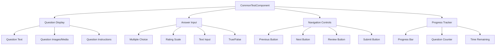
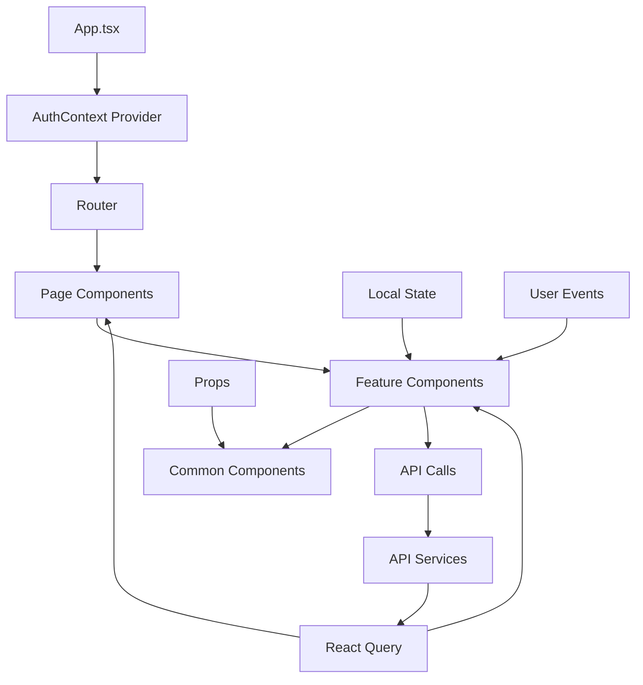

# Z Plus Counselling Platform - Component Architecture

## 🧩 Frontend Component Structure

This document details the React component architecture and how components interact within the Z Plus Counselling Platform.

## 📁 Component Hierarchy

```
src/components/
├── 🔐 auth/
│   └── ProtectedRoute.tsx          # Route protection wrapper
├── 🎨 common/
│   └── Navbar.tsx                  # Global navigation component
├── 📊 dashboard/
│   └── (Dashboard components)      # User dashboard widgets
├── 👤 profile/
│   ├── TestHistoryComponent.tsx    # User test history display
│   └── TestStatsDashboard.tsx      # Statistics dashboard
├── 📋 results/
│   └── TestResultDashboard.tsx     # Test results visualization
└── 🧪 tests/
    ├── CommonTest.tsx              # Shared test functionality
    └── CommonTestComponent.tsx     # Reusable test component
```

## 🔐 Authentication Components

### **ProtectedRoute Component**
```typescript
// Purpose: Protect routes that require authentication
// Location: src/components/auth/ProtectedRoute.tsx

interface ProtectedRouteProps {
  children: React.ReactNode;
  requiredRole?: 'USER' | 'ADMIN';
}

const ProtectedRoute: React.FC<ProtectedRouteProps> = ({ 
  children, 
  requiredRole = 'USER' 
}) => {
  const { user, isLoading } = useAuth();
  
  // Flow:
  // 1. Check if user is authenticated
  // 2. Verify user has required role
  // 3. Redirect to login if not authenticated
  // 4. Show access denied if insufficient permissions
  // 5. Render children if authorized
};
```

### **Authentication Flow Integration**
```mermaid
graph TD
    A[User Navigates to Protected Route] --> B[ProtectedRoute Component]
    B --> C{User Authenticated?}
    C -->|No| D[Redirect to Login Page]
    C -->|Yes| E{Has Required Role?}
    E -->|No| F[Show Access Denied]
    E -->|Yes| G[Render Protected Component]
    
    D --> H[LoginPage Component]
    H --> I[AuthService.login()]
    I --> J[Backend Authentication]
    J --> K[JWT Token Received]
    K --> L[Update AuthContext]
    L --> M[Redirect to Original Route]
```

## 🎨 Common Components

### **Navbar Component**
```typescript
// Purpose: Global navigation and user status
// Location: src/components/common/Navbar.tsx

const Navbar: React.FC = () => {
  const { user, logout } = useAuth();
  
  // Features:
  // - Logo and brand name
  // - Navigation links based on authentication status
  // - User profile dropdown
  // - Logout functionality
  // - Mobile responsive menu
};
```

### **Navigation Structure**
```
Authenticated User:
├── Dashboard
├── Tests
│   ├── Personality Tests
│   ├── Psychology Tests
│   └── Education Tests
├── Results
├── Profile
└── Logout

Unauthenticated User:
├── Home
├── About
├── Tests (Preview)
├── Blog
├── Login
└── Register
```

## 👤 Profile Components

### **TestHistoryComponent**
```typescript
// Purpose: Display user's test history with filtering and sorting
// Location: src/components/profile/TestHistoryComponent.tsx

interface TestHistoryProps {
  userId: string;
  limit?: number;
  showFilters?: boolean;
}

const TestHistoryComponent: React.FC<TestHistoryProps> = ({
  userId,
  limit = 10,
  showFilters = true
}) => {
  // Features:
  // - Paginated test history
  // - Filter by test type, date range, status
  // - Sort by date, score, completion time
  // - Quick actions (retake, view results, download report)
  // - Loading states and error handling
};
```

### **TestStatsDashboard**
```typescript
// Purpose: Visual statistics dashboard for user performance
// Location: src/components/profile/TestStatsDashboard.tsx

const TestStatsDashboard: React.FC = () => {
  // Features:
  // - Overall test statistics (total tests, average score)
  // - Performance trends over time
  // - Category-wise performance breakdown
  // - Achievement badges and milestones
  // - Interactive charts using Recharts
};
```

## 📋 Results Components

### **TestResultDashboard**
```typescript
// Purpose: Comprehensive test result visualization
// Location: src/components/results/TestResultDashboard.tsx

interface TestResultProps {
  testResult: TestResult;
  showRecommendations?: boolean;
  allowRetake?: boolean;
}

const TestResultDashboard: React.FC<TestResultProps> = ({
  testResult,
  showRecommendations = true,
  allowRetake = true
}) => {
  // Features:
  // - Score visualization with charts
  // - Detailed answer breakdown
  // - Personality/skill insights
  // - Recommendations based on results
  // - PDF report generation
  // - Social sharing options
};
```

## 🧪 Test Components

### **CommonTestComponent**
```typescript
// Purpose: Reusable test taking interface
// Location: src/components/tests/CommonTestComponent.tsx

interface CommonTestProps {
  testType: string;
  questions: Question[];
  onAnswerSubmit: (answer: Answer) => void;
  onTestComplete: (results: TestResults) => void;
}

const CommonTestComponent: React.FC<CommonTestProps> = ({
  testType,
  questions,
  onAnswerSubmit,
  onTestComplete
}) => {
  // Features:
  // - Question navigation (previous/next)
  // - Progress indicator
  // - Answer validation
  // - Auto-save functionality
  // - Timer (if applicable)
  // - Review answers before submission
};
```

### **Test Component Architecture**


## 📊 Page Components

### **Page Structure Overview**
```
src/pages/
├── auth/
│   ├── LoginPage.tsx               # User login interface
│   └── RegisterPage.tsx            # User registration interface
├── home/
│   └── HomePage.tsx                # Landing page
├── profile/
│   └── ProfilePage.tsx             # User profile management
├── tests/
│   ├── PersonalityTestPage.tsx     # Personality test interface
│   ├── PsychologyTestPage.tsx      # Psychology test interface
│   └── EducationTestPage.tsx       # Education test interface
├── results/
│   └── ResultsPage.tsx             # Test results display
├── blog/
│   └── BlogPage.tsx                # Blog and articles
└── career/
    └── CareerPage.tsx              # Career guidance
```

### **Page Component Pattern**
```typescript
// Standard page component structure
const PageComponent: React.FC = () => {
  // 1. Authentication check (if required)
  const { user } = useAuth();
  
  // 2. Data fetching
  const { data, loading, error } = useQuery(/* API call */);
  
  // 3. Local state management
  const [localState, setLocalState] = useState();
  
  // 4. Effect hooks for side effects
  useEffect(() => {
    // Page initialization logic
  }, []);
  
  // 5. Event handlers
  const handleAction = () => {
    // Handle user interactions
  };
  
  // 6. Conditional rendering
  if (loading) return <LoadingSpinner />;
  if (error) return <ErrorMessage error={error} />;
  
  // 7. Main component render
  return (
    <PageLayout>
      <PageContent />
    </PageLayout>
  );
};
```

## 🔄 Component Communication

### **Data Flow Pattern**


### **State Management Strategy**
```typescript
// Global State (AuthContext)
interface AuthContextType {
  user: User | null;
  isLoading: boolean;
  login: (email: string, password: string) => Promise<void>;
  logout: () => void;
  updateProfile: (data: Partial<User>) => Promise<void>;
}

// Server State (React Query)
const useUserProfile = (userId: string) => {
  return useQuery({
    queryKey: ['user', userId],
    queryFn: () => userApi.getProfile(userId),
    staleTime: 5 * 60 * 1000, // 5 minutes
  });
};

// Local Component State
const [formData, setFormData] = useState<FormData>({});
const [isSubmitting, setIsSubmitting] = useState(false);
```

## 🎨 Styling Architecture

### **Tailwind CSS Strategy**
```typescript
// Component-specific styling patterns
const componentStyles = {
  // Layout
  container: "max-w-7xl mx-auto px-4 sm:px-6 lg:px-8",
  grid: "grid grid-cols-1 md:grid-cols-2 lg:grid-cols-3 gap-6",
  
  // Cards
  card: "bg-white rounded-lg shadow-md p-6 border border-gray-200",
  cardHover: "hover:shadow-lg transition-shadow duration-200",
  
  // Buttons
  primaryButton: "bg-blue-600 text-white px-4 py-2 rounded-md hover:bg-blue-700 transition-colors",
  secondaryButton: "bg-gray-200 text-gray-700 px-4 py-2 rounded-md hover:bg-gray-300 transition-colors",
  
  // Forms
  input: "block w-full px-3 py-2 border border-gray-300 rounded-md focus:outline-none focus:ring-2 focus:ring-blue-500",
  label: "block text-sm font-medium text-gray-700 mb-2",
};
```

### **Responsive Design Patterns**
```typescript
// Mobile-first responsive design
const ResponsiveComponent: React.FC = () => {
  return (
    <div className="
      grid grid-cols-1           // Mobile: 1 column
      sm:grid-cols-2             // Small: 2 columns
      md:grid-cols-3             // Medium: 3 columns
      lg:grid-cols-4             // Large: 4 columns
      xl:grid-cols-5             // Extra large: 5 columns
      gap-4 sm:gap-6 lg:gap-8    // Progressive gap sizes
    ">
      {/* Component content */}
    </div>
  );
};
```

## 🧪 Component Testing Strategy

### **Testing Patterns**
```typescript
// Component test example
import { render, screen, fireEvent } from '@testing-library/react';
import { QueryClient, QueryClientProvider } from '@tanstack/react-query';
import { AuthProvider } from '../context/AuthContext';
import TestComponent from './TestComponent';

const renderWithProviders = (component: React.ReactElement) => {
  const queryClient = new QueryClient({
    defaultOptions: { queries: { retry: false } }
  });
  
  return render(
    <QueryClientProvider client={queryClient}>
      <AuthProvider>
        {component}
      </AuthProvider>
    </QueryClientProvider>
  );
};

describe('TestComponent', () => {
  test('renders correctly', () => {
    renderWithProviders(<TestComponent />);
    expect(screen.getByText('Test Title')).toBeInTheDocument();
  });
  
  test('handles user interaction', () => {
    renderWithProviders(<TestComponent />);
    fireEvent.click(screen.getByRole('button', { name: 'Submit' }));
    // Assert expected behavior
  });
});
```

## 🔧 Performance Optimization

### **Component Optimization Strategies**
```typescript
// Memoization for expensive computations
const ExpensiveComponent = React.memo(({ data }) => {
  const processedData = useMemo(() => {
    return expensiveDataProcessing(data);
  }, [data]);
  
  const handleClick = useCallback((id: string) => {
    // Handle click event
  }, []);
  
  return <div>{/* Component content */}</div>;
});

// Lazy loading for code splitting
const LazyTestPage = React.lazy(() => import('./pages/tests/PersonalityTestPage'));

// Usage in router
<Suspense fallback={<LoadingSpinner />}>
  <LazyTestPage />
</Suspense>
```

### **Bundle Optimization**
```typescript
// Dynamic imports for feature-specific code
const loadChartLibrary = async () => {
  const chartModule = await import('recharts');
  return chartModule;
};

// Conditional component loading
const ConditionalChart = ({ showChart }) => {
  if (!showChart) return null;
  
  return (
    <Suspense fallback={<div>Loading chart...</div>}>
      <ChartComponent />
    </Suspense>
  );
};
```

This component architecture ensures maintainable, scalable, and performant React components throughout the Z Plus Counselling Platform.